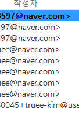

# 1. 깃허브에 쩜이 안찍혔다
  

소스트리를 통해 계속 푸쉬를 했는데 내 프로필에 쩜이 안찍혔다.  
이유를 알 수 없었는데 계정이 2개인데 다른 계정으로 계속 푸쉬하고 있던 것이다.  

 
아까운 나의 쩜...ㅜㅜㅜ  
다음에는 꼭 푸쉬를 하고 확인하자(*꒦ິㅂ꒦ີ)  
 

--------------------------
# 2. [생활코딩](https://youtu.be/tZooW6PritE)의 HTML과 CSS를 들었다  
  
까먹었던 html과 css를 다시 들었는데 예전에 배웠던 것 중 다루지 않은 것도 많았다  
조금 더 공부를 해야할 것 같다  
마침 예전에 결제한 코드잇에 강의가 있어서 내일은 코드잇을 정복하는 걸로  
  
  
 
반응형을 위해 @media를 다뤘는데 처음에 작동이 안됐다.  

그냥 계속 새로고침 했다가 껐다 키니까 작동이 됐다. 안됐던 이유를 모르겠다.  
*@media min, max의 개념이 헷갈린다 다시 봐야한다  
min : 이상  
max : 이하  
면 실행이 된다  

--------------------
# 3. 오늘의 목표
- ~~생활코딩 html, css 다 보기~~ 완료
- ~~1일 1푸쉬, 깃블로그 업로드하기~~ 완료
